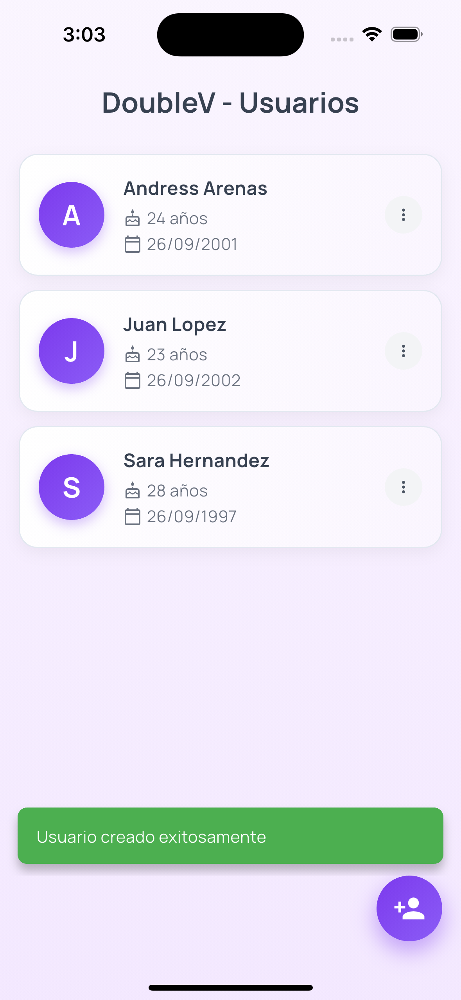
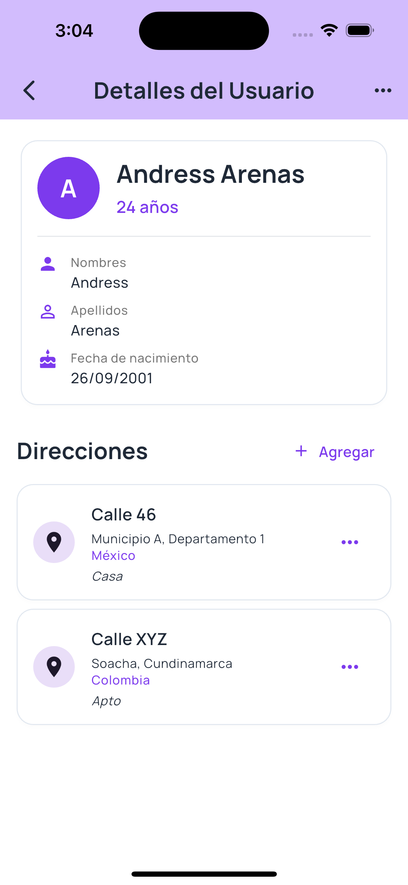
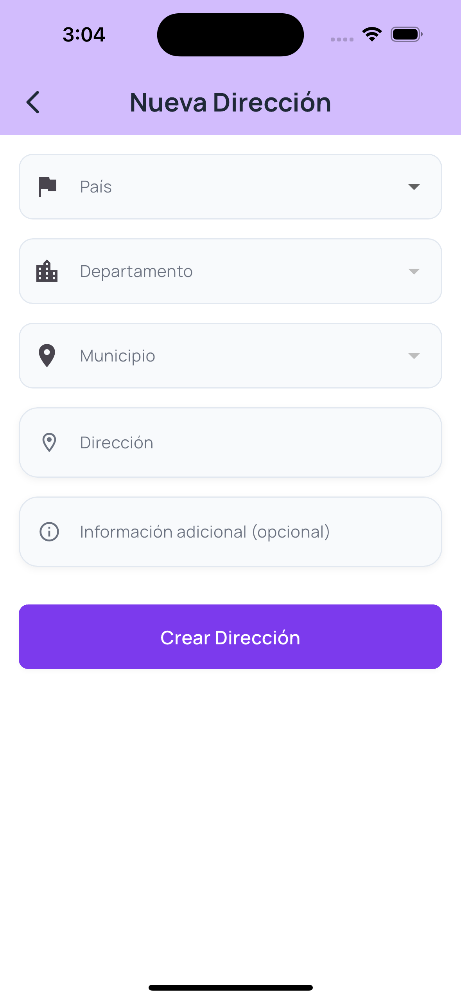

# DoubleV - Aplicación de Gestión de Usuarios

<div align="center">


**Aplicación móvil desarrollada con Clean Architecture y principios SOLID**

*Prueba Técnica para Double V Partners NYX*

</div>

---

## 📖 Descripción

Aplicación móvil Flutter para gestionar usuarios y direcciones con arquitectura empresarial, implementando Clean Architecture, principios SOLID y las mejores prácticas de desarrollo.

### ✨ Características Principales

- **👤 CRUD Completo de Usuarios** - Crear, visualizar, editar y eliminar
- **🏠 Múltiples Direcciones** - Selección jerárquica país → departamento → municipio  
- **🏗️ Clean Architecture** - Separación clara en capas domain/data/presentation
- **🧪 Testing Completo** - 22 tests unitarios y de widgets
- **📱 UI/UX Moderna** - Material 3 con validaciones en tiempo real
- **💾 Persistencia Local** - Hive NoSQL para almacenamiento eficiente

---

## 📱 Screenshots

<table>
  <tr>
    <td align="center">
      
      <br/><strong>Pantalla Principal</strong>
      <br/><em>Lista de usuarios</em>
    </td>
    <td align="center">
      
      <br/><strong>Formulario Usuario</strong>
      <br/><em>Validaciones en tiempo real</em>
    </td>
  </tr>
  <tr>
    <td align="center">
      
      <br/><strong>Detalle Usuario</strong>
      <br/><em>Info completa + direcciones</em>
    </td>
    <td align="center">
      
      <br/><strong>Formulario Dirección</strong>
      <br/><em>Selección jerárquica</em>
    </td>
  </tr>
</table>

---

## 🏗️ Arquitectura

### Clean Architecture Implementada
```
presentation/ → domain/ → data/
     ↓            ↓         ↓
   Pages      Entities   Models
   Widgets    Use Cases  Data Sources
   Providers  Interfaces Repositories
```

### Stack Tecnológico
- **Flutter 3.9.2** + **Dart 3.0** - Framework multiplataforma
- **Riverpod 2.4.9** - Estado reactivo y dependency injection
- **Go Router 12.1.3** - Navegación declarativa type-safe
- **Hive 2.2.3** - Base de datos NoSQL local
- **Material 3** - Design system moderno

### Principios SOLID ✅
- **S** - Single Responsibility | **O** - Open/Closed  
- **L** - Liskov Substitution | **I** - Interface Segregation
- **D** - Dependency Inversion

---

## 🚀 Instalación

```bash
# 1. Clonar repositorio
git clone <repository-url>
cd doublev

# 2. Instalar dependencias
flutter pub get

# 3. Generar código Hive
dart run build_runner build

# 4. Ejecutar aplicación
flutter run
```

**Prerrequisitos:** Flutter ≥3.9.2, Dart ≥3.0, IDE, Simulador/Emulador

---

## 📊 Calidad del Código

### Métricas de Calidad
```bash
flutter analyze
# ✅ No issues found! (0 errors, 0 warnings)

flutter test  
# ✅ All tests passed! (22/22 tests)
```

### Cobertura de Testing
- **Tests Unitarios** - Entidades User/Address, utilidades
- **Tests de Widgets** - Inicialización de app
- **Principios SOLID** - 100% implementados
- **Type Safety** - Fuertemente tipado

---

## 🎯 Funcionalidades

### Gestión de Usuarios
- ✅ Crear con validaciones (nombres, apellidos, fecha nacimiento)
- ✅ Lista con pull-to-refresh y navegación fluida
- ✅ Detalle completo con edad calculada automáticamente
- ✅ Editar información existente
- ✅ Eliminar con confirmación segura

### Gestión de Direcciones  
- ✅ Múltiples direcciones por usuario
- ✅ Selección jerárquica: País → Departamento → Municipio
- ✅ Validaciones inteligentes y campos opcionales
- ✅ Gestión individual de direcciones

### Experiencia de Usuario
- ✅ Navegación intuitiva con rutas tipadas
- ✅ Estados de loading elegantes
- ✅ Manejo robusto de errores
- ✅ Responsive design adaptable

---

## 🗂️ Estructura del Proyecto

```
lib/
├── main.dart                   # Punto de entrada
├── core/                       # Utilidades compartidas  
│   ├── constants/              # Rutas y constantes
│   ├── errors/                 # Manejo de excepciones
│   ├── theme/                  # Material 3 personalizado
│   └── utils/                  # Validaciones y utilidades
├── features/                   # Módulos por funcionalidad
│   ├── user/                   # Módulo usuarios
│   │   ├── data/              # Hive models, data sources
│   │   ├── domain/            # Entities, use cases, repos
│   │   └── presentation/      # Pages, widgets, providers
│   └── address/               # Módulo direcciones
└── shared/providers/          # Dependency injection
```

---

## 🔧 Comandos de Desarrollo

```bash
# Análisis y formateo
flutter analyze
dart format .

# Testing
flutter test                    # Todos los tests
flutter test test/unit/         # Solo unitarios
flutter test --coverage        # Con cobertura

# Build
flutter build apk --release    # Android
flutter build ios --release    # iOS
```

---

## 🎯 Decisiones Técnicas

**Clean Architecture:** Separación clara, testabilidad, mantenibilidad a largo plazo  
**Riverpod vs BLoC:** Menos boilerplate, mejor DX, type safety superior  
**Hive vs SQLite:** Performance óptima, no SQL complexity, type safety con codegen  
**Go Router:** Navegación declarativa, rutas tipadas, mejor que Navigator 2.0

---

## 👨‍💻 Información del Desarrollador

**Andrés Arenas**  
*Candidato para Double V Partners NYX*

📧 **Email:** [andresadar@hotmail.com]  
🐙 **GitHub:** [andresadar]

---

## 📄 Notas de Entrega

- **✅ Arquitectura:** Clean Architecture completa
- **✅ Testing:** 22/22 tests passing
- **✅ Análisis:** 0 errors, 0 warnings  
- **✅ Funcionalidades:** Todas implementadas según specs
- **✅ Documentación:** README + SETUP completos

**Desarrollado con Flutter y dedicación total** 🚀

---

<div align="center">

*Septiembre 2025 - Double V Partners NYX*

</div>
